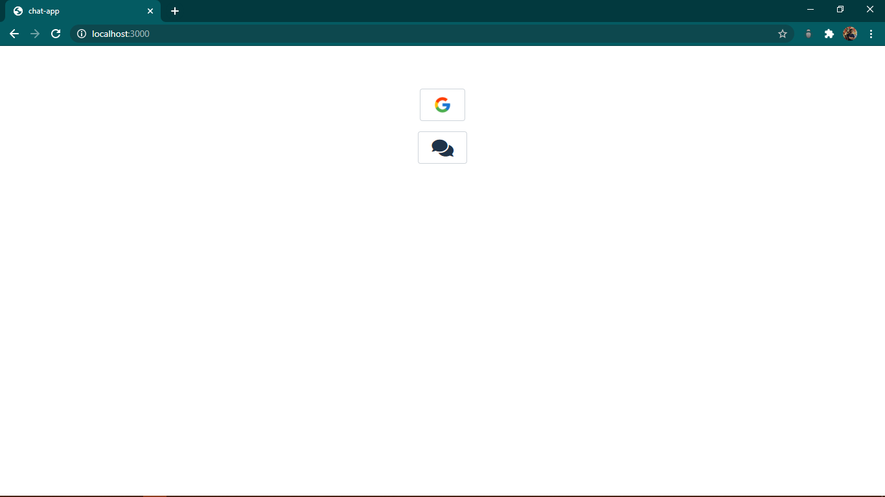
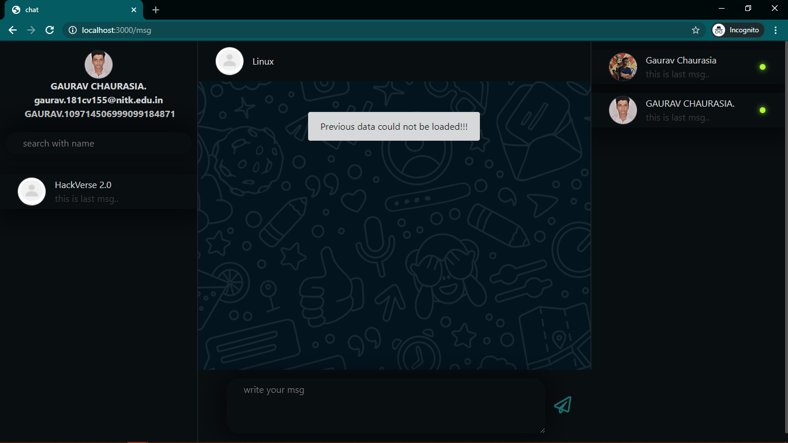
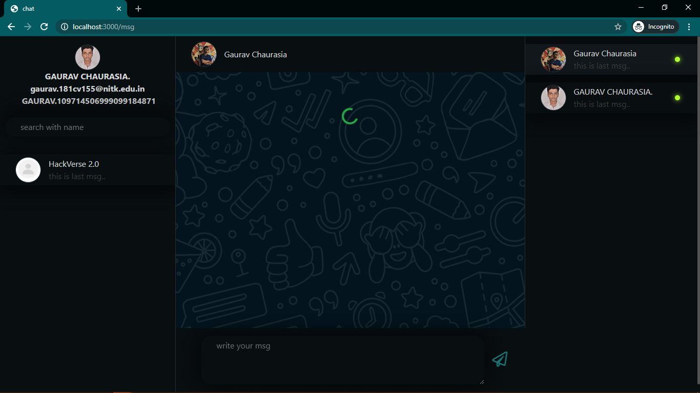

# chat-app

> Note: All steps were performed using on Windows 10.  
> [Link](https://dlhd.herokuapp.com/msg)  
> [ScreenShots](#ScreenShots)  

### INSTALLATIONS

> RUN LOCALLY
> Note: All steps were performed using on Windows 10.

- Install `node(14.15.0)` 
  - [NODEJS](https://nodejs.org/en/)
  - Use default setting and just keep clicling `next` till finish

- Install `Git` 
  -[GIT](https://git-scm.com/)
  - Use default setting and just keep clicling `next` till finish


### RUN LOCALLY

- Clone the Repo:

```
        $ git clone https://github.com/gaurav-chaurasia/chat-app.git
```

- Move to the folder where you cloned the project 
- Install all dependencies and devDependencies by running the following command

```
        $ npm install
```

- Before running the server add `.env` file in root folder or simply replace `.env.example` with `.env` file and add your keys
- to get Client id & Client Secret [link](https://www.balbooa.com/gridbox-documentation/how-to-get-google-client-id-and-client-secret)
- to get `DATABASE_CONNECTION_URL` and make DB connection [link](https://medium.com/@sergio13prez/connecting-to-mongodb-atlas-d1381f184369)

```js
        # database connection url
        DATABASE_URI=<YOUR_DATABASE_CONNECTION_URL>

        # client id & secret for OAuth
        GOOGLE_OAUTH2_CLIENT_ID=<YOUR_OAUTH_CLIENT_ID>
        GOOGLE_OAUTH2_CLIENT_SECRET=<YOUR_OAUTH_CLIENT_SECRET>
```


- Now run the server by running following command
  - dev runs the sever with nodemon which automatically restart server everytime we make any changes  

```js
    $ npm start
```

- The above steps starts the development server on localhost:3000 
- Go to `http://localhost:3000/` in your browser 
- It will automatically redirect you to the Home page and then ask for Signup or Login.

#### ScreenShots

> Home Page ROOT ROUTE    


> /msg page    


